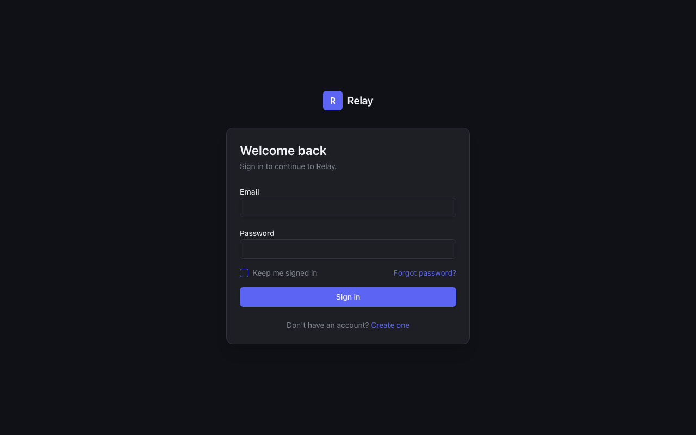
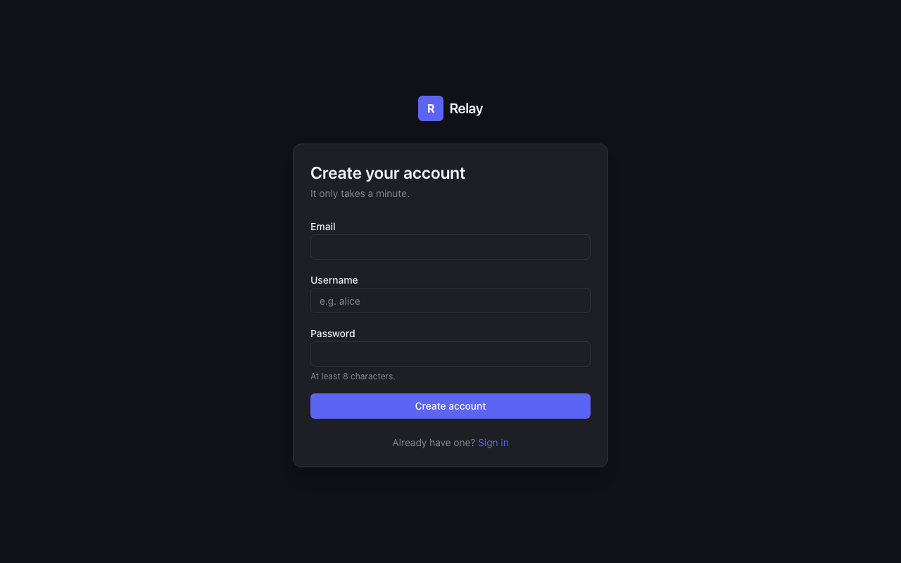
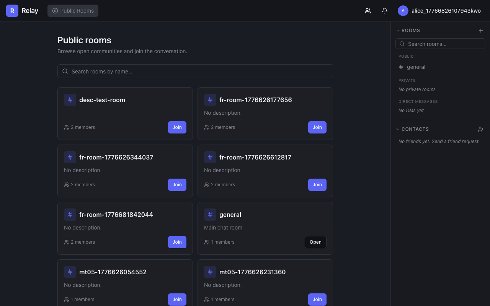
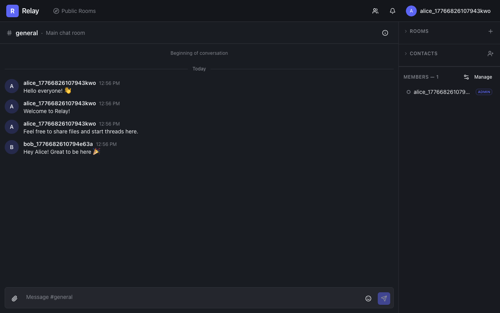
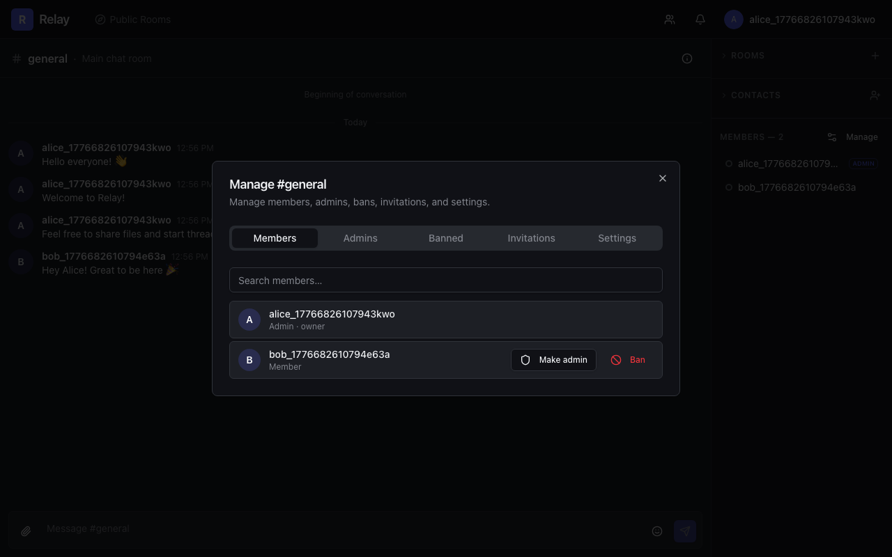
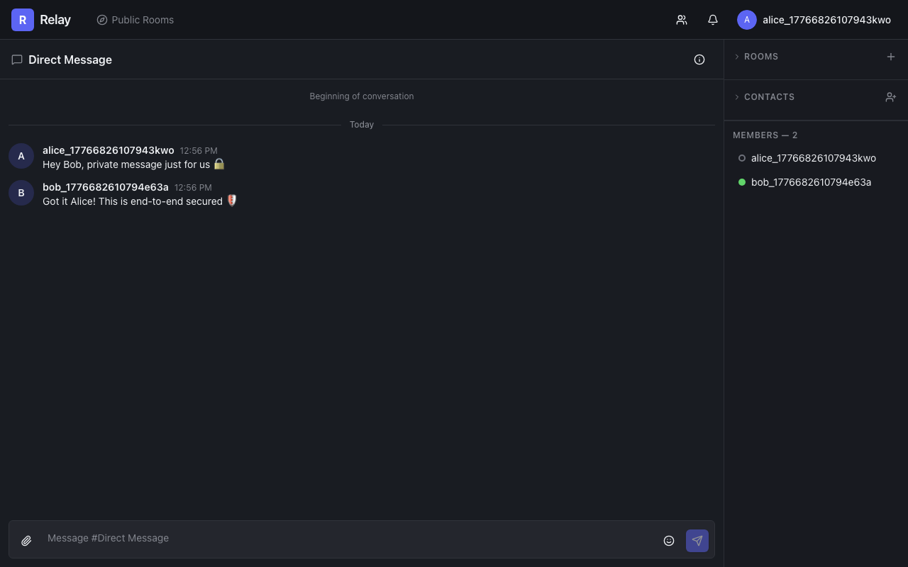
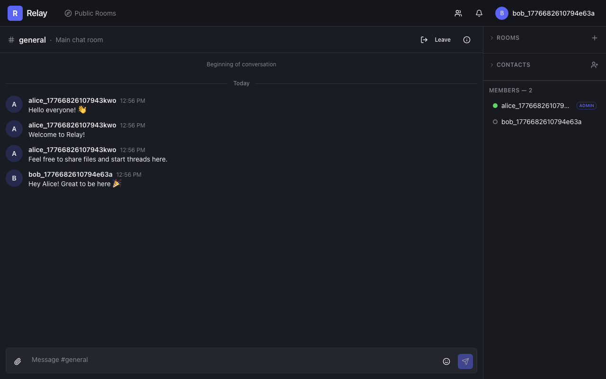

# Relay — Real-Time Chat Application

A full-stack, production-ready chat application with real-time messaging, presence tracking, file sharing, friend system, and moderation tools.

## Quick Start

```bash
# Clone and start — everything runs in Docker
git clone <repo-url>
cd ai-chat-app
docker compose up -d
```

Open **http://localhost:3000** — the app is live.

| Service  | URL                        |
|----------|----------------------------|
| App      | http://localhost:3000      |
| API      | http://localhost:8080      |
| MailHog  | http://localhost:8025      |
| Postgres | localhost:5433             |

> **First run takes ~2 min** — Docker builds both images from source before starting.

---

## Tech Stack

| Layer | Technology |
|-------|-----------|
| Backend | Kotlin 1.9 · Spring Boot 3.2 · Spring WebSocket (STOMP) · Spring Security 6 |
| Database | PostgreSQL 16 · Flyway migrations · Spring Data JPA |
| Auth | JWT (JJWT 0.12) · httpOnly cookies · Bucket4j rate limiting |
| File handling | Apache Tika 2.9 (magic-byte MIME validation) |
| Email | Spring Mail → MailHog (dev) |
| Frontend | React 19 · TypeScript · Vite 7 · TanStack Router v1 · TanStack Query v5 |
| Real-time | @stomp/stompjs v7 · SockJS |
| UI | Tailwind CSS v4 · Radix UI · shadcn/ui |
| Testing | Testcontainers + JUnit 5 (backend) · Playwright 1.59 (frontend E2E) |
| Infra | Docker Compose · nginx (reverse proxy + WebSocket upgrade) |

---

## Features

### User Accounts
- Register / login / logout with email + username + password
- Persistent sessions ("keep me signed in" → 30-day token; session cookie otherwise)
- Multi-session support: view and revoke individual sessions by browser / IP
- Password reset via email link (one-time token, 15-min TTL, SHA-256 stored)
- Change password while logged in; delete account (cascades owned rooms)
- Login brute-force protection: 10 failed attempts / 60 s per IP → 429

### Chat Rooms
- Create **public** or **private** rooms with name and description
- Room names globally unique (case-insensitive)
- Public room catalog with full-text search
- Join / leave rooms; owner must delete rather than leave
- Owner and admin roles; owner's admin rights are permanent
- Invite users to private rooms by username
- Room settings: rename, change description, toggle visibility

### Messaging
- Send, edit, and soft-delete messages (own messages; admins can delete any)
- **Replies** — quoted parent message preserved in thread
- **File / image attachments** — upload then attach to a message
  - MIME validation from magic bytes (not `Content-Type` header) via Tika
  - 20 MB upload limit; 3 MB per-file application cap
  - Download restricted to room members; respects bans
- Infinite scroll history — keyset pagination (`before=`, `after=` cursors)
- < 200 ms response at 100 K+ messages (index on message ID)
- Gap recovery on STOMP reconnect: fetches missed messages via `after=` cursor

### Presence & Notifications
- Real-time presence: **ONLINE** / **AFK** / **OFFLINE** for all friends
- Activity-driven heartbeat (pointer move, keydown, click) — throttled 1/2 s
- Tab hidden → instant AFK signal via `document.visibilitychange`
- Multi-tab aware: BroadcastChannel coordination; only the active tab sends heartbeats
- Server-side AFK scanner: 60 s idle → AFK; fires every 10 s
- Unread message counts per room / DM; auto-cleared on room open
- Push notifications for friend requests, acceptances, and room invitations

### Friends & Direct Messages
- Send / accept / reject friend requests (with optional message)
- DM room created automatically on friend request acceptance
- Friends list with live presence dots
- Remove friend; user-to-user ban (freezes DM, blocks new requests)

### Moderation
- Ban / unban members from rooms; banned users cannot rejoin
- View ban list with banned-by and date
- Kick member from room
- Promote / demote members to admin (owner cannot be demoted)
- Global user ban (blocks DMs)

### Non-Functional
- **NFR-1** Presence accuracy — event-driven, not polled; handles browser hibernation
- **NFR-2** STOMP gap recovery — missed messages fetched on reconnect
- **NFR-3** Large history — 10 K+ messages scrollable with no duplicates, correct order, < 1 s per page
- **NFR-4** Resource cleanup — daily scheduled job removes expired sessions and tokens
- **NFR-5** N+1 fix — attachments batch-loaded in a single query per message page
- **NFR-6** Rate limiting — Bucket4j in-memory, IP-keyed, 10 attempts / 60 s

---

## Architecture

```
Browser
  │
  ├─ HTTP/REST ──► nginx :3000 ──► backend :8080 /api/**
  │
  └─ WebSocket ──► nginx :3000 ──► backend :8080 /ws  (SockJS → STOMP)
                                        │
                                   Spring Broker
                              ┌─────────┴──────────┐
                         /topic/room.*        /user/queue/*
                         (broadcast)          (unicast: presence,
                                               notifications)

backend :8080
  ├─ REST controllers   (api/)
  ├─ STOMP handlers     (ws/)
  ├─ Domain services    (domain/)
  ├─ JPA + Flyway       → postgres :5432
  └─ Spring Mail        → mailhog :1025

frontend :5173 / nginx :3000
  ├─ TanStack Router    (file-based, /routes)
  ├─ AuthContext        (JWT refresh scheduler)
  ├─ StompContext       (single WebSocket, all subscriptions)
  └─ TanStack Query     (server-state cache, invalidated by STOMP events)
```

### Backend Package Layout

```
com.example.chat
  api/          REST @RestControllers (one per domain)
  ws/           @MessageMapping STOMP handlers + JwtChannelInterceptor
  domain/
    user/       User, Session, PasswordResetToken, services
    room/       Room, RoomMember, RoomBan, RoomReadCursor, services
    message/    Message, Attachment, services
    friend/     Friendship, UserBan, services
    presence/   PresenceService (in-memory ConcurrentHashMap)
    notification/ NotificationService
    file/       FileStorageService (Tika + disk)
  config/       SecurityConfig, WebSocketConfig, JwtUtil, LoginRateLimiter
  dto/          Request / Response data classes
```

### Database Schema (11 tables)

```
users                    — accounts (email, username, password_hash)
sessions                 — JWT sessions (token_hash, expires_at, browser_info, ip)
password_reset_tokens    — reset links (token_hash, expires_at, used_at)
rooms                    — rooms (name, visibility: PUBLIC|PRIVATE|DM, owner_id)
room_members             — membership (room_id, user_id, role: OWNER|ADMIN|MEMBER)
room_bans                — room-level bans (room_id, user_id, banned_by_id)
messages                 — chat messages (room_id, sender_id, content, deleted_at)
attachments              — file metadata (uuid, room_id, message_id nullable, mime, size)
room_read_cursors        — unread tracking (room_id, user_id, last_read_message_id)
friendships              — friend relationships (requester_id, addressee_id, status)
user_bans                — global user bans (banner_id, banned_id)
```

---

## API Reference

All endpoints are under `/api`. Authentication uses an `access_token` httpOnly cookie set on login. Errors return `{ "error": "ERROR_CODE" }`.

### Auth

| Method | Path | Auth | Description |
|--------|------|------|-------------|
| POST | `/auth/register` | — | Create account; returns access token cookie |
| POST | `/auth/login` | — | Authenticate; sets access + refresh token cookies |
| POST | `/auth/logout` | ✓ | Revoke current session |
| POST | `/auth/refresh` | cookie | Renew access token (refresh_token cookie) |
| GET | `/auth/me` | ✓ | `{ userId, username }` |
| GET | `/auth/sessions` | ✓ | List active sessions |
| DELETE | `/auth/sessions/{id}` | ✓ | Revoke a session |
| POST | `/auth/forgot-password` | — | Send reset email |
| POST | `/auth/reset-password` | — | Consume token, set new password |
| POST | `/auth/change-password` | ✓ | Change password (current + new) |

### Rooms

| Method | Path | Description |
|--------|------|-------------|
| POST | `/rooms` | Create room |
| GET | `/rooms?q=` | Search public rooms |
| GET | `/rooms/me` | My rooms with unread counts |
| GET | `/rooms/{id}` | Room details |
| PATCH | `/rooms/{id}` | Update room (owner) |
| DELETE | `/rooms/{id}` | Delete room (owner; cascades) |
| POST | `/rooms/{id}/join` | Join public room |
| DELETE | `/rooms/{id}/leave` | Leave room |
| GET | `/rooms/{id}/members` | List members |
| PATCH | `/rooms/{id}/members/{userId}` | Change member role |
| POST | `/rooms/{id}/invitations` | Invite to private room |
| GET | `/rooms/{id}/bans` | List bans |
| POST | `/rooms/{id}/bans` | Ban user |
| DELETE | `/rooms/{id}/bans/{userId}` | Unban user |
| GET | `/rooms/{id}/unread` | Unread count |
| POST | `/rooms/{id}/read` | Mark all read |

### Messages

| Method | Path | Description |
|--------|------|-------------|
| GET | `/messages/{roomId}?before={id}&limit=50` | Older messages (keyset) |
| GET | `/messages/{roomId}?after={id}&limit=100` | Newer messages (gap recovery) |

### Friends & Users

| Method | Path | Description |
|--------|------|-------------|
| GET | `/friends` | Friends list with presence |
| GET | `/friends/requests` | Incoming friend requests |
| POST | `/friends/requests` | Send request |
| PATCH | `/friends/requests/{id}` | Accept / reject (`action: ACCEPT\|REJECT`) |
| DELETE | `/friends/{userId}` | Remove friend |
| POST | `/users/{id}/ban` | Ban user globally |
| DELETE | `/users/{id}/ban` | Unban user |
| DELETE | `/users/me` | Delete own account |

### Files & Admin

| Method | Path | Description |
|--------|------|-------------|
| POST | `/files/upload` | Upload file (multipart); returns `{ attachmentId, filename, mimeType, sizeBytes }` |
| GET | `/files/{id}` | Download file (members only) |
| GET | `/admin/stats` | System stats (expired sessions/tokens, totals) |

### STOMP WebSocket

Connect to `ws://host/ws` (SockJS). Authenticate via `access_token` cookie or `Authorization` STOMP CONNECT header.

**Send:**

| Destination | Payload | Description |
|-------------|---------|-------------|
| `/app/chat.send` | `{ roomId, content, parentMessageId?, attachmentIds[] }` | Send message |
| `/app/chat.edit` | `{ messageId, content }` | Edit message |
| `/app/chat.delete` | `{ messageId }` | Delete message |
| `/app/presence.activity` | `{}` | Heartbeat (user active) |
| `/app/presence.afk` | `{}` | Signal AFK |

**Subscribe:**

| Destination | Event types | Description |
|-------------|-------------|-------------|
| `/topic/room.{id}` | `message`, `edit`, `delete`, `member_joined`, `member_left`, `user_banned`, `user_unbanned`, `role_changed`, `room_updated`, `DELETED` | All room events |
| `/user/queue/presence` | `{ userId, status: ONLINE\|AFK\|OFFLINE }` | Friend presence updates |
| `/user/queue/notifications` | `friend_request`, `friend_request_accepted`, `room_invitation`, `DM_BANNED` | User notifications |

---

## Development

### Prerequisites

- Docker & Docker Compose
- JDK 21 (for local backend)
- Node.js 20+ (for local frontend)

### Fast Loop (recommended)

```bash
# 1. Start infrastructure only
docker compose up -d postgres mailhog

# 2. Backend (hot-reload via Spring DevTools)
cd backend
./gradlew bootRun --args='--spring.profiles.active=local'
# Ready at http://localhost:8080

# 3. Frontend (Vite HMR)
cd frontend
npm install
npm run dev
# Ready at http://localhost:5173
```

Save a `.kt` file → Spring reloads in ~2 s. Save a `.tsx` file → Vite pushes the update instantly.

### Full Docker Loop

Use only for final integration checks or when testing the nginx configuration:

```bash
docker compose up -d --build   # rebuild images
docker compose ps              # verify all healthy
docker compose down            # stop (keep data)
docker compose down -v         # stop + wipe DB
```

### Configuration

| Profile | When | DB | Mail | Uploads |
|---------|------|----|------|---------|
| _(none)_ | Docker | `postgres:5432` (internal) | `mailhog:1025` | `/app/uploads` |
| `local` | Local JVM + Docker infra | `localhost:5433` | `localhost:1025` | `/tmp/chat-local-uploads` |
| `test` | Testcontainers | Dynamic (container) | `localhost:1025` | `/tmp/chat-test-uploads` |

**Required environment variable (production):**
```
JWT_SECRET=<random-string-at-least-32-chars>
```

---

## Testing

### Backend Integration Tests

```bash
cd backend

# All tests (Testcontainers spins up its own Postgres)
./gradlew test

# Single slice
./gradlew test --tests "*Slice4*" --rerun

# Force re-run (bypass Gradle cache)
./gradlew test --rerun
```

Tests use `@SpringBootTest(webEnvironment = RANDOM_PORT)` with a shared Testcontainers Postgres. MailHog must be running (`docker compose up -d mailhog`) for email-related tests.

### Frontend E2E Tests (Playwright)

Requires backend on `:8080` and Vite dev server on `:5173` (fast loop).

```bash
cd frontend

# All 82 tests
npx playwright test e2e/ --project=chromium

# Single spec
npx playwright test e2e/sliceF4.spec.ts --project=chromium

# Single test by name
npx playwright test --grep "T-F4-08"

# Debug mode (headed browser)
npx playwright test e2e/sliceF4.spec.ts --debug

# View last run report
npx playwright show-report
```

> Tests run serially (`workers: 1`) — parallel execution causes STOMP timing races.

### Test Coverage Summary

| Suite | Tests | Scope |
|-------|-------|-------|
| Backend Slice 2–10 | ~60 | Auth, rooms, messaging, presence, friends, files, notifications |
| Frontend F2–F7 | 67 | Full UI regression across all features |
| Manual / QA | 11 | Edge-case bugs (token reuse, unread counts, file upload, reply chains) |
| NF | 4 | Presence accuracy, STOMP gap recovery, large history, reconnect |

---

## Project Structure

```
ai-chat-app/
├── backend/                 Kotlin + Spring Boot
│   ├── src/main/kotlin/     Application source
│   ├── src/main/resources/
│   │   ├── application.yml         Docker config
│   │   ├── application-local.yml   Local dev config
│   │   └── db/migration/           Flyway SQL migrations
│   └── build.gradle.kts
├── frontend/                React + TypeScript
│   ├── src/
│   │   ├── routes/          TanStack Router pages
│   │   ├── components/      Reusable UI components
│   │   ├── contexts/        AuthContext, StompContext
│   │   └── lib/             API client, services, types
│   ├── e2e/                 Playwright tests
│   └── nginx.conf           nginx config for Docker image
├── docker-compose.yml
├── api-definition.yaml      OpenAPI 3.0 spec (authoritative contract)
├── requirements.md          Functional requirements
└── non-functional-requirements.md
```

---

## Screenshots


*Sign-in form with "Keep me signed in" option*


*Account creation with email, username, and password*


*Public room catalog with search and live member counts*


*Real-time two-user conversation in a public room*


*Room management: Members tab with Make Admin / Ban actions*


*Direct message conversation with ONLINE presence indicator*


*Full app view: sidebar rooms, contacts with presence dots, and member panel*

## Screens

| Route | Screen |
|-------|--------|
| `/login` | Sign-in form with "keep me signed in" |
| `/register` | Account creation |
| `/forgot-password` | Request reset email |
| `/reset-password?token=` | Set new password |
| `/rooms` | App shell: sidebar + content area |
| `/rooms/catalog` | Public room browser with search |
| `/rooms/:id` | Chat view with message history, file upload, replies |

The main shell (`/rooms`) includes:
- **Left sidebar** — room list (public / private / DMs) with unread badges, contacts with presence dots, create-room button, friend-request button
- **Center** — message thread with infinite scroll, reply chain, attachment preview
- **Right panel** — room info, member list, manage-room modal (members / admins / bans / invitations / settings tabs)
- **Top bar** — logo, Public Rooms link, friend-request bell, user dropdown (sessions, settings, sign out)

---

## Security Notes

- Passwords hashed with bcrypt (Spring Security defaults)
- JWT stored in `HttpOnly; Secure; SameSite=Lax` cookies — inaccessible to JavaScript
- File MIME type validated from magic bytes (Tika), not the `Content-Type` header
- File downloads restricted to room members; bans checked before serving
- Password reset tokens stored as SHA-256 hash (not bcrypt — tokens are high-entropy random, SHA-256 is correct here)
- No-enumeration on password reset: always returns 200 regardless of whether the email exists
- Session revocation is immediate (checked on every request via DB lookup)

---

## License

MIT
